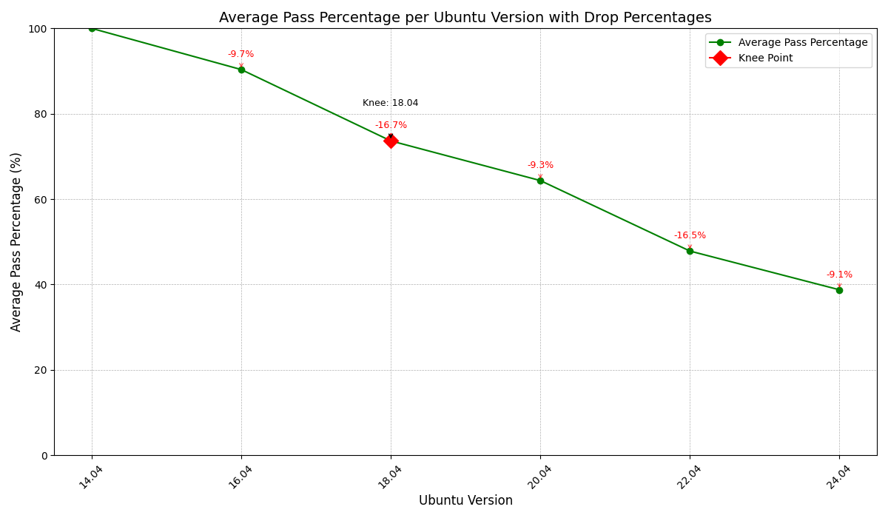
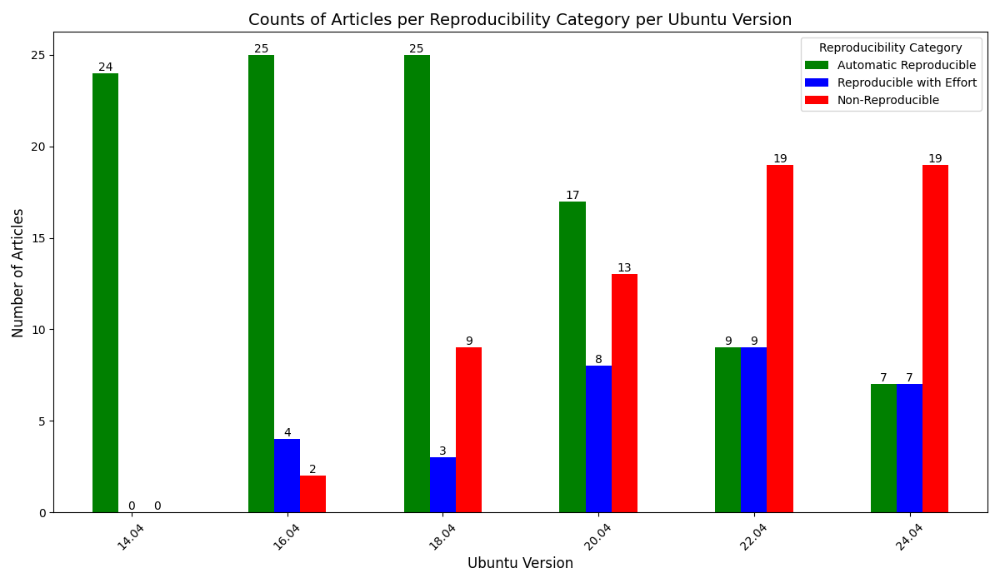
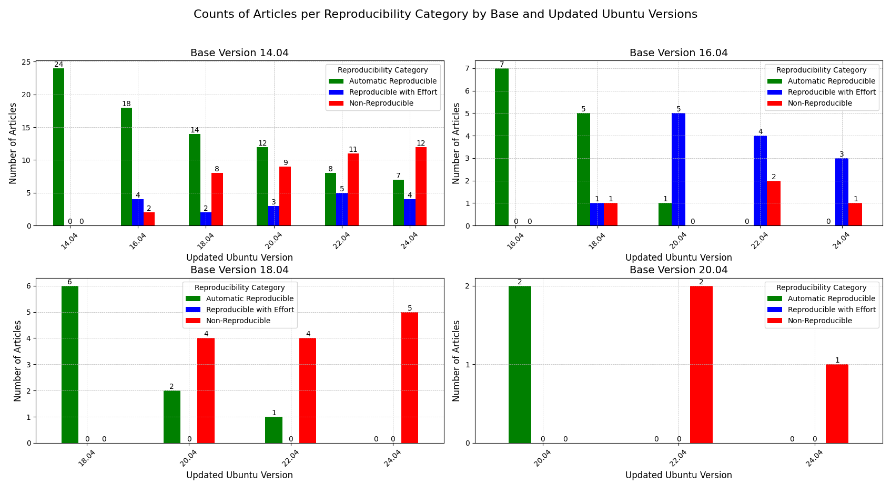
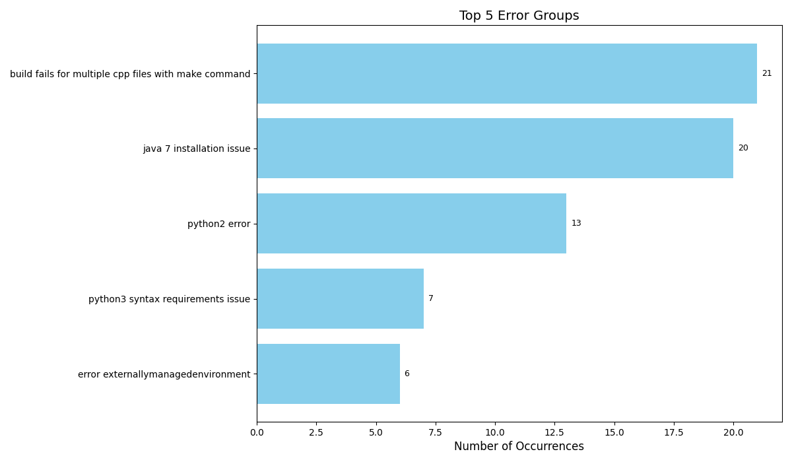
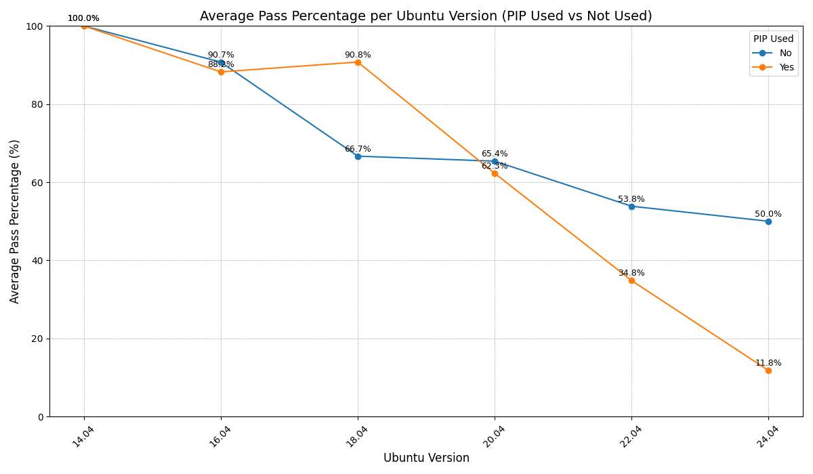
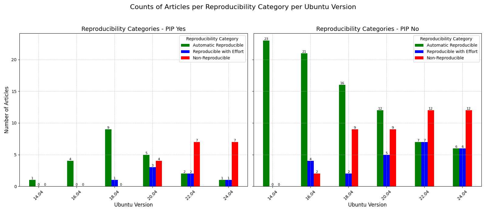

# Dockerfile Reproducibility Analysis and Automation

## Project Overview
This project focuses on analyzing the semantic variations of Dockerfiles for MP2 to ensure bitwise reproducibility across Ubuntu versions. The project involves error classification, evaluation of package managers, and the use of LLM-assisted automation to build and fix Dockerfiles.

## Key Objectives
1. **Analyze Reproducibility**: Assess how reproducible Dockerfiles are across Ubuntu versions, identifying common challenges and errors.
2. **Package Manager Evaluation**: Compare the performance of PIP vs. apt-get in achieving reproducibility and determine if converting dependencies improves outcomes.
3. **Error Classification**: Identify and categorize errors affecting reproducibility, including dependency issues and environment-specific errors.
4. **Automation**: Implement an LLM-assisted workflow for automating the building, error detection, and fixing of Dockerfiles.

## Selection Criteria for Dockerfiles
- Must build successfully for the base version.
- Includes a functional test that verifies output accuracy.
- Does not rely solely on output file existence for verification.
- Does not execute random project files without verifying outputs.
- Includes additional tests that can be incorporated into the Dockerfile.
- Preferably based on Ubuntu 14.04/16.04 for upgrade compatibility.
- Build time should not exceed 20 minutes.

## Collected Data
For each analyzed Dockerfile, the following data was recorded:
- Bibcode
- Base Ubuntu Version
- Updated Ubuntu Version
- Cases Passed
- Cases Failed
- Pass Percentage
- Package Manager Used (PIP vs. apt-get)
- Error Details
- Modifications to Dockerfile

## Metrics and Visualizations
The following metrics were calculated and visualized:
1. **Reproducibility Metrics**:
   - Automatic Reproducibility
   - Reproducibility with Effort

2. **Graphs and Findings**:

### Graph 1: Average Pass Percentage vs. Ubuntu Version

- Observed a significant drop of 16.7% in reproducibility when switching to Ubuntu 18.04.
- Another major drop of 16.5% occurred with Ubuntu 22.04.
- Pass percentage includes both Automatic Reproducibility and Reproducibility with Effort.

### Graph 2: Reproducibility Categories per Ubuntu Version

- Visualizes counts of articles categorized as Automatic Reproducible, Reproducible with Effort, and Non-Reproducible for each Ubuntu version.

### Graph 3: Reproducibility Data per Base Ubuntu Version

- Shows reproducibility trends for different base Ubuntu versions.

### Graph 4: Top 5 Error Categories

- Highlights the most common errors, including outdated dependencies (Java 7, Python 2), build failures, and environment-specific issues like "externally managed environment."

### Graph 5: Average Pass Percentage (PIP vs. apt-get)

- apt-get shows better reproducibility due to fewer issues with Python 2 dependency breaking on newer Ubuntu versions.

### Graph 6: Reproducibility Trends for Different Package Managers

- Visualizes the impact of different package managers (PIP vs. apt-get) across reproducibility categories.

## Key Findings
1. **Reproducibility Trends**:
   - Ubuntu 18.04 caused a 16.7% drop in reproducibility, the most significant among tested versions.
   - Ubuntu 22.04 showed another major drop of 16.5%.
   - Ubuntu 14.04 and 16.04 exhibited strong reproducibility.

2. **Error Classification**:
   - Common issues include outdated dependencies (e.g., Java 7, Python 2), build failures, and environment-specific errors.
   - NLP techniques were used to cluster similar errors for better categorization.

3. **Package Manager Comparison**:
   - apt-get outperformed PIP in reproducibility due to Python 2-related issues in PIP-based Dockerfiles.
   - While PIP retains package versions better, its reliance on Python 2 in older files caused compatibility issues with Ubuntu 20.04+.

4. **Automation**:
   - Automated workflow using Llama 3.2 successfully identified errors and suggested fixes.
   - Fine-tuned models could further improve success rates.

## Automation Demo
A script was developed to:
1. Locate all Dockerfiles in a directory and build them for different Ubuntu versions.
2. Log details and results in a CSV file.
3. Use Llama 3.2 LLM API to propose fixes for errors based on logs.
4. Retry builds with updated Dockerfiles until success or a predefined retry limit is reached.

**Demo Video**: [View Demo](https://uofi.box.com/s/6viiw70pzd9s7tng5d726w4j6gr5yv5k)

## Repository Contents
- **[analytics_v3.py](./analytics_v3.py)**: Script for analyzing reproducibility metrics and visualizing data.
- **[automate_building_dockerfiles.py](./automate_building_dockerfiles.py)**: Script for automating Dockerfile building, error detection, and fixing.
- **Dataset**: [Spreadsheet with collected data](https://docs.google.com/spreadsheets/d/12XfzmpOmKiBWzqgWf6wBQh9TpRQa2p1487wZYMQ-kn0/edit?usp=sharing).
- **Graphs**: Visual representations of the findings.

## Link to Final Report
**Final Report**: [Read the Full Report](./final-report.md)

## Discussion Points
1. **Reproducibility**: Highlighted significant drops in reproducibility with Ubuntu 18.04 and 22.04.
2. **Errors**: Categorized and visualized common errors, offering insights into reproducibility challenges.
3. **PIP vs. apt-get**: Identified apt-get as more reliable for older Dockerfiles but noted the potential of PIP with version control.
4. **LLM Integration**: Demonstrated the feasibility of automating reproducibility fixes with LLMs like Llama 3.2, with room for further optimization.

## Future Work
- Explore fine-tuned LLMs for more accurate error fixes.
- Investigate alternative package managers like Nix or Conda for reproducibility improvements.
- Extend analysis to include additional Ubuntu versions and more diverse datasets.

## Getting Started
### Prerequisites
- Python 3.x
- Docker
- Required Python libraries (install via `pip install -r requirements.txt`)

### Running the Automation Script
```bash
python automate_building_dockerfiles.py
```

### Running the Analytics Script
```bash
python analytics_v3.py
```

## Contact
For questions or contributions, please contact Daksh Gandhi at [your_email@example.com].

