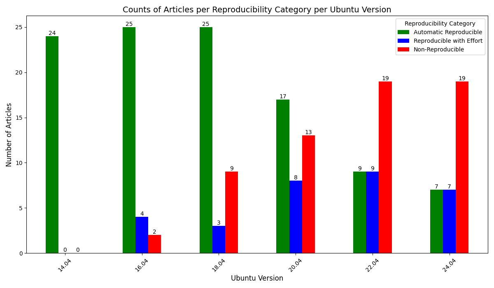
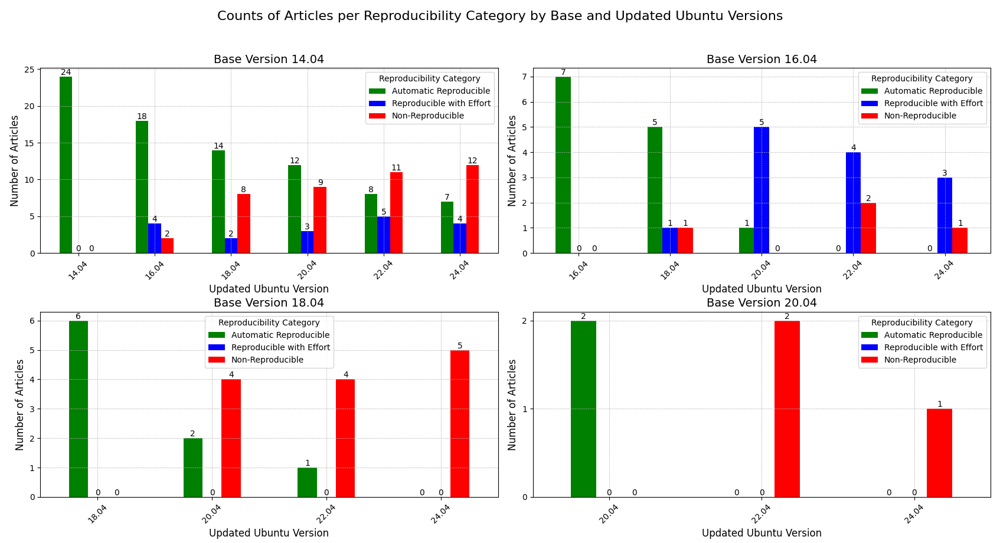
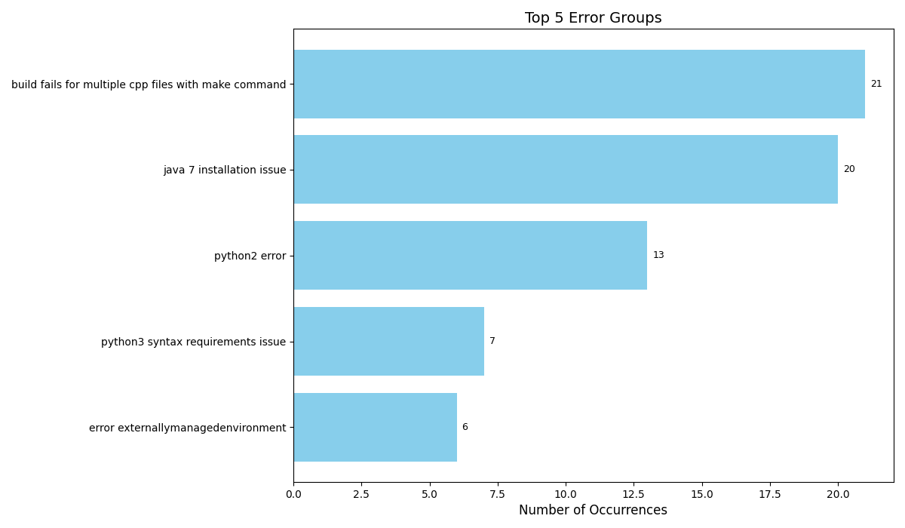

### Problem Statement
Analyzing semantic variations of Reproducible Articles (Dockerfiles) to ensure bitwise reproducibility across Ubuntu versions, with error classification and LLM-assisted automated building and fixing.

### Selection criteria for Dockerfiles
- Builds successfully for base version (skipping other files)
- Calls a functional test given by the develeoper and verifies the output.
- Does NOT have functional tests just checking for the existence of an output file.
- Does NOT run a random file from the project and is verfying "some output" is generated without veryfing the output itself.
- Has additional tests we can add to the Dockerfile
- Has base ubuntu version as 14.04/16.04, so we have enough space to update it till 22.04/24.04. (Preferred, not necessary)
- Does not take longer than 20 minutes to build the file.

### Evaluation
Collected the following data for each bibcode, "Bibcode, Base Version, Updated Ubuntu Version, Cases Passed, Cases Failed, Pass Percentage, PIP Used, Error Details, Modifications to Dockerfile" and plot data for different Linux and installed package versions.

### Overview 
Tested 68 Dockerfiles out of which I shortlisted and analyzed 40 dockerfiles, collecting in-depth data about their reproducibility based on ubuntu version changes.
This process was done manually, and we have a script to analyze the manually collected data. 
Over the semester, I have worked towards answering the following questions,

1. How reproducible are these articles across Ubuntu versions?
2. What are the common errors faced?
3. Reproducibility of Dockerfiles with PIP vs Non-PIP (apt-get) Dockerfiles, which package manager fares better?
4. Does converting apt-get to PIP actually helps? If so, how much?
5. Automatic Repair - Is it possible to automate this process, with possibility of LLM to solve errors?

### Analyzed:
With all the data I collected, I was able to write a script to calculate the following metrics,

1. Automatic Reproducibility
2. Reproducibility with Effort
3. Plotted Graphs for,
    - Average Pass Percentage vs Ubuntu Version.
    - Categorized Counts of Automatic Reproducible/ Reproducible with Effort / Non-Reproducible per Ubuntu Version.
    - Top 5 errors and the number of their occurences.
    - Average Pass Percentage per Ubuntu Version (PIP Used vs apt-get)
    - Counts of Articles per Reproducibility Category per Ubuntu Version (PIP Used vs apt-get)
4. Which Ubuntu version breaks the most cases (Knee of the graph)
5. Most Popular Errors observed - Utilized NLP to cluster similar errors to narrow them down.

### Results
All collected data is logged on this spreadsheet, https://docs.google.com/spreadsheets/d/12XfzmpOmKiBWzqgWf6wBQh9TpRQa2p1487wZYMQ-kn0/edit?usp=sharing . 
 
Check both the sheets in the document for all details.

[Script for analyzing the data](./analytics_v3.py)

Number of Bibcodes/Articles I worked upon. (Details in spreadsheet linked above)

Graph-1

Here we can see that the switch to Ubuntu 18.04 causes a drop of 16.7% in reproducibility. This is the most impactful ubuntu version switch.
Pass Percentage in this graph is calculated including both Automatic Reproducible and Reproducible with Effort.
 
---
 

Graph-2

This graph helps us visualize how many articles are Automatic Reproducible vs Reproducible with Effort vs Non-Reproducible for each Ubuntu version.
 
---
 

Graph-3

This graph helps us visualize the Reproducibility data per base ubuntu version.
 
---
 

Graph-4

This graph gives us the Top 5 Error Categories we observed throughout this experiment with their counts.
 
---
 

Graph-5

This graph comparea the Average Pass Percentage of articles for Dockerfiles usuing PIP vs those Not using PIP. Interestingly, the graph favors apt-get. This is because Dockerfiles using PIP usually involve python2, which ends up breaking over ubuntu 20.04 with the switch to python3. This causes the graph of PIP vs apt-get to skew in the favor of apt-get having better reproducibility, even though PIP allows retaining package versions across ubuntu versions.
 
---
 

Graph-6

Similar to the 2nd Graph, we can visualize how using different package managers fare across Reproducibility. 
 
---
 

### Demo - Automatic Repair - LLM assisted

[Automation Script](./automate_building_dockerfiles.py)
 
**DEMO VIDEO LINKED HERE**
 
https://uofi.box.com/s/6viiw70pzd9s7tng5d726w4j6gr5yv5k 
 

I was able to automate the following, 
1. Locate all Dockerfiles in a directory and build them one by one, changing ubuntu versions for each run. 
2. Log all details and results, in a CSV format that we can analyze.
3. If an error occurs, send Dockerfile + Last 200 Error lines to Llama 3.2 LLM API asking for a fixed/updated Dockerfile.
4. Retry with the updated/fixed Dockerfile.
5. Configure how many times do we want to retry asking LLM and try to build the updated Dockerfile.

### Discussion

1. **How reproducible are these articles across Ubuntu versions?**
    We answered this question in the form of graphs and concluded that Ubuntu 18.04 was a major change in ubuntu that impacted a ~16.7% of the articles in our dataset! Another major drop was in 22.04, where we observed 16.5% drop in reproducibility. Other than that, 14.04, 16.04 show strong reproducibility for most parts.

2. **What are the common errors faced?**
    This information is visualized in Graph-4. The analysis highlights common issues, such as outdated dependencies (e.g., Java 7, Python 2), build failures with make, and environment-specific errors like "externally managed environment." These emphasize the need for modernizing tools, standardizing dependency management, and adopting containerized solutions like Docker or Conda for reproducibility.

3. **Reproducibility of Dockerfiles with PIP vs Non-PIP (apt-get) Dockerfiles, which package manager fares better?**
    The 6th graph helps us visualize this impact. Dockerfiles using PIP usually involve python2, which ends up breaking over ubuntu 20.04 with the switch to python3. This causes the graph of PIP vs apt-get to skew in the favor of apt-get having better reproducibility, even though PIP allows retaining package versions across ubuntu versions.

4. **Does converting apt-get to PIP actually helps?**
    For my dataset, most failures were due to packages like gcc/g++/make which are not supported by PIP. Therefore I could not convert these dependencies to be installed by PIP. However, I did try using Nix and Conda, to try and make some of these articles reproducible. Transitioning a Dockerfile to Nix or Conda required significant restructuring and adaptation, and I made considerable progress in understanding and applying these tools. These tools hold great promise for preserving package versions across OS versions, and my efforts have provided valuable insights and a solid starting point for further advancements in this area.

5. **Is it possible to automate this process, with possibility of LLM to solve errors?**
    Yes, as demonstrated in the project, automating the entire process, including error identification and fixing, is highly feasible using Large Language Models (LLMs). In my implementation, I successfully utilized Llama 3.2 to automate tasks such as dependency resolution, build configuration adjustments, and error debugging. The LLM was integrated into the workflow to interpret error logs, identify the root causes, and propose solutions, which were then applied to the Dockerfiles automatically.
    While the results with Llama 3.2 were promising, there is significant potential to improve the success rate by employing a fine-tuned model or a reasoning-focused LLM like O1-preview or O1-mini. These models are designed to handle more complex problem-solving tasks and can better contextualize errors to generate more accurate and effective fixes.
    The workflow involved the following steps:

    - Error Detection: Parsing error logs during the build process to identify specific issues.
    - Solution Proposal: Feeding the errors into the LLM to generate potential fixes, such as modifying dependencies, adjusting build commands, or switching package versions.
    - Automated Testing: Applying the fixes and re-running the build process to verify the solution's effectiveness.
    - Iteration: If the fix failed, the LLM iteratively refined its solution based on updated logs.

    This approach not only automates a tedious process but also significantly accelerates debugging and improves reproducibility in software environments.

